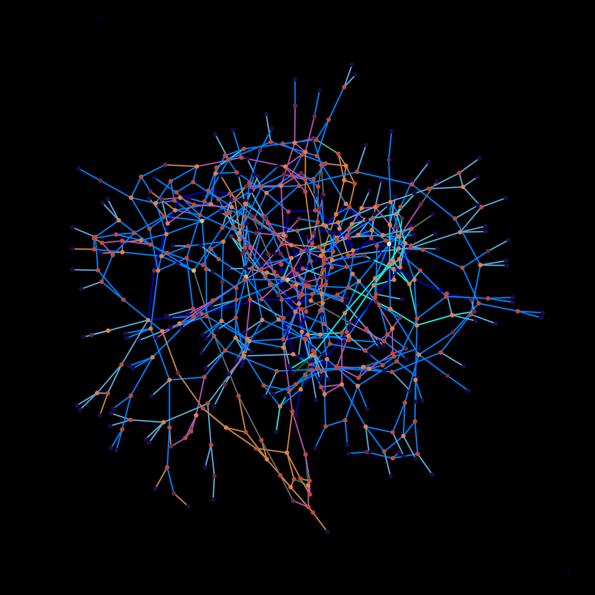
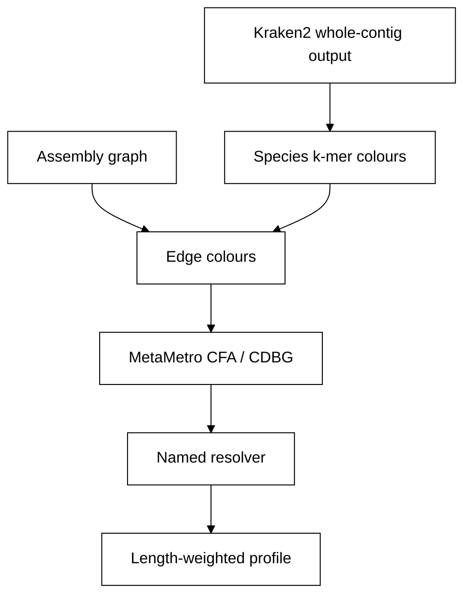

# metaMalevich 
### Taxonomic re-profiling on a coloured assembly graph

[](VERSION)
[](https://github.com/dsmutin/metaMalevich/actions/workflows/required-tests.yml)
[](https://github.com/dsmutin/metaMalevich/actions/workflows/full-tests.yml)
[](LICENSE)
[](environment.yml)

metaMalevich re-profiles a metagenome after assembly. A k-mer classifier labels contigs, but those labels stay multi-label colours on the assembly graph until a named resolver turns them into one distribution per contig. The profile is the length-weighted sum of those distributions. The aim is a community profile closer to the simulated truth than the hard classifier call, at the taxonomic rank the community was built to test.

The Python package and the conda environment are named `metamalevich`. Concepts and the scored tables are in the [wiki](https://github.com/dsmutin/metaMalevich/wiki).

## How it works

1. Read whole-contig Kraken2 output. `cpp/kraken_count` sums `taxid:count` pairs. Counts at species or below roll to species. Genus-or-coarser k-mers and taxid 0 are dropped, not pushed onto child species. The hard colouring is a one-hot of the rolled Kraken call.
2. Build the graph the resolver is allowed to use. The `samovar10` bench rebuilds a canonical 4-mer cosine k-nearest-neighbour graph (`top_k=8`, `min_sim=0.15`) with `cpp/kmer_knn`. Example communities use the MEGAHIT assembly graph (`megahit_toolkit contig2fastg` on the kept `k<int>.contigs.fa`). That FASTG is the assembler edge list. A second graph, when one is built, is computed from those contig sequences and is labelled as such.
3. Store node colours and edge colours separately. An edge colour is the renormalized minimum of the two endpoint distributions. [MetaMetro](https://github.com/dsmutin/MetaMetro) writes the coloured graph as a CFA and then a CDBG. Topology is checked after colouring.
4. Run a named resolver. Each one returns a full distribution per node. Graph-free methods are the hard call, `probability_sum`, and LCA. Graph methods add an edge colour, a decaying neighbour signal, a line-graph flip, a logistic filter fit on pseudo-labels, and the lock, rescue, and mixture rules in `todo.md`. The library machine-learning method is that logistic filter. A GCN is not in this tree. Parameters are recorded with the hypothesis.
5. Write a length-weighted profile. Relative abundance is the share of contig bases. Coverage is not an input and is not a colour channel. Nodes are split into unique, shared, ambiguous, and unclassified. On `samovar10`, a hypothesis beats the hard colouring only when L1 falls and macro F1 rises. Example communities report the same hypotheses at the rank in the table below. Read-level baselines are Kraken2 and Kaiju, scored against the simulation abundance table.



## Method expectation

`todo.md` is the checklist. A checked row has code and a committed score. The `samovar10` manifests record `software_version: 0.4.1`; `VERSION` is newer, and that bench has not been regenerated since.

| Stage | In this tree |
|-------|----------------|
| Annotators alone | Kraken2 and Kaiju on the reads; contig hypotheses `initial_colouring`, `probability_sum`, `lca` |
| Edge colour | Renormalized minimum of the endpoint distributions; `edge_union`, `bayesian_edge`, `gated_neighbour` |
| Node k-mer composition | Canonical 4-mer cosine kNN on `samovar10`; `composition_genus` on that space. Example communities keep the MEGAHIT FASTG |
| Decaying neighbour signal | `leakage` |
| Line-graph flip | `leakage_flipped`, `label_drop_flipped`, `logistic_drop_flipped` |
| Logistic filter | `logistic_drop`, pseudo-labels from neighbour agreement |
| Bayesian reprofile | `bayesian_edge` |
| Further scored resolvers | `label_drop`, `confident_lock`, `unanimous_rescue`, `cut_then_leak`, `genus_plurality`, `margin_mixture` |
| Absent | Coverage as a node colour; GCN, GraphSAGE, GAT; path-aware resolution; read-to-graph reassignment |

Abundance scores are required to use the taxon id assigned to each read before simulation. The `samovar10` bench scores the shipped contig table and does not open `samovar10/reads/`. Example node F1 uses minimap2. The simulated taxon id stays out of any GCN graph and its colours; no GCN is built. `examples/low75/ds/colour_features.py` fits a logistic model on minimap-derived genus truth, and that fit is not a graph colouring.

## Install

Conda is the supported install. Python dependencies and `gxx_linux-64` are pinned in `environment.yml`. The compiler builds `cpp/kraken_count` and `cpp/kmer_knn` on first use.

```bash
git clone https://github.com/dsmutin/metaMalevich
cd metaMalevich
conda env create -f environment.yml
conda activate metamalevich
```

`environment.yml` sets `PYTHONPATH=src:external/MetaMetro/src`. Run commands from the repository root. The submodule `external/MetaMetro` is [dsmutin/MetaMetro](https://github.com/dsmutin/MetaMetro) at the commit recorded in this repository. GitHub Actions checks that submodule out and installs it into the conda env. Colourings and `benchbuild` communities live there. MetaMetro's `full-tests` workflow runs `metametro benchbuild --all`.

```bash
git clone --recurse-submodules https://github.com/dsmutin/metaMalevich
```

`METAMETRO_SRC` overrides the submodule when it points at a MetaMetro `src` directory. Details: [How to install](https://github.com/dsmutin/metaMalevich/wiki/How-to-install).

## Usage

```bash
python -m metamalevich --version
python -m metamalevich
python examples/toy/run.py
python -m metamalevich bench --data-root . --benchmark benchmark
python -m metamalevich solve --bench bubble_strain_2 --bench phage_10
```

`solve` builds the named MetaMetro benches and runs `gated_neighbour` on `composition_kmeans` and `decaying`. It does not read `ground_truth/`. `phage_10` is the five-phage bench at 10× read depth (`phage_species_5_x10`). That assembly runs when samovar, MEGAHIT, and the five genome FASTA files are already present. Otherwise the command records the MetaMetro contract for that bench.

With no command, the CLI runs a three-node toy and prints JSON. `bench` reads Kraken2 output already stored for `samovar10`, builds the 4-mer graph, colours nodes and edges, and writes each hypothesis under `benchmark/{hypothesis}/{dataset}/`. Reusable counts and edges go to `./intermediate`. `samovar10_ont1b` repeats the same FASTA, Kraken2 output, and ground truth, so it is not a second dataset. On `samovar10`, `genome_abundance` matches the base share, so the benchmark scores how bases are classified.

## Examples

Genomes, reads, and indexes are not committed. Each directory's README is the protocol. Scores are in that directory's `RESULTS.md`, at the rank the design can still match.

| Example | Score rank | Design |
|---------|------------|--------|
| `examples/toy` | — | Three nodes. Neighbour mixing must beat the hard colouring on L1. |
| `samovar10`, `examples/heldout_genera`, `examples/half_strains` | species | The simulated species is in the reference. |
| `examples/low75`, `examples/low75half`, `examples/low75_enriched`, `examples/low75half_enriched` | genus | The database species is a different species of the same genus. Enriched runs use the same genera at 10× read depth. |
| `examples/high100`, `examples/half100half`, `examples/high100_enriched`, `examples/half100half_enriched` | family | Communities are paired inside a family, including pairs from different genera. Enriched runs use the same families at 10× read depth. |

`examples/heldout_genera/` builds twenty simulated assemblies and uses twenty held-out assemblies as the Kraken2 and Kaiju databases. `examples/half_strains/` repeats that pipeline on every other strain. `examples/low75/` uses 25 genera each of bacteria, archaea, and viruses. `examples/low75half/` keeps every other of those genera. `examples/high100/` uses 25 families each of bacteria, archaea, viruses, and small eukaryotes, two genomes per family. `examples/half100half/` keeps every other of those families.

## Tests

```bash
pytest -m mandatory    # every commit
pytest                 # mandatory and optional
```

## License

MIT. See [LICENSE](LICENSE).

Cite Kraken 2 for the classifier (Wood, Lu, and Langmead, Genome Biology, 2019, doi:10.1186/s13059-019-1891-0) and [MetaMetro](https://github.com/dsmutin/MetaMetro) for the coloured-graph containers.
